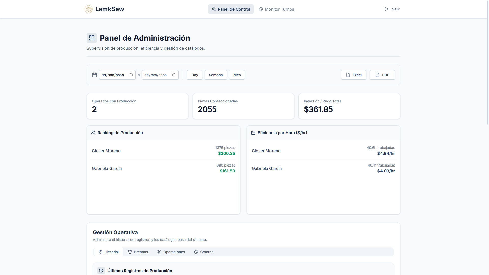
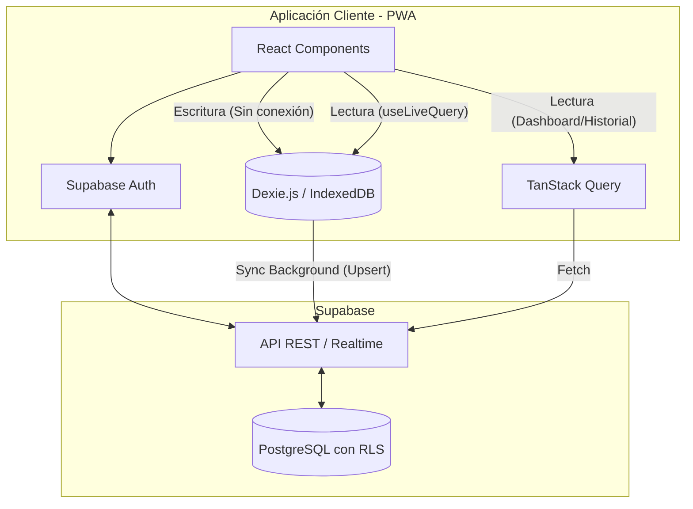

# LamkSew: Sistema de Producción y Destajo Offline-First

Un sistema web progresivo (PWA) diseñado para la gestión de producción y cálculo de pagos a destajo en la industria de la confección. Construido para operar en entornos con **conectividad intermitente o nula**, garantizando que los operarios nunca pierdan un registro de producción.




## El Problema y la Solución

**El Contexto:** En los talleres de confección textil, el pago a operarios se realiza comúnmente "a destajo" (por operación completada). Sin embargo, el wifi en los talleres suele ser inestable, y depender de papel o de sistemas cloud tradicionales genera cuellos de botella y pérdida de datos.

**La Solución:** LamkSew es una PWA que funciona localmente. Los operarios inician su turno y registran sus bultos (piezas, operaciones, colores, lotes) directamente contra una base de datos local (IndexedDB). Cuando el dispositivo recupera la conexión, el sistema sincroniza silenciosamente con el servidor (Supabase) resolviendo conflictos.

## Características Principales

*   **100% Offline-First (Operarios):** Registro de producción, inicio/fin de turnos y lectura de catálogos sin conexión a internet.
*   **Sincronización Resiliente:** Uso de UUIDs locales (`local_id`) para evitar duplicidad durante los *upserts* asíncronos en la nube.
*   **Control de Asistencia:** Trazabilidad estricta de turnos para calcular la eficiencia real ($/hora).
*   **Dashboard Administrativo (Tiempo Real):** Ranking de producción, eficiencia por operario, y exportación a PDF/Excel.
*   **PWA Instalable:** Experiencia nativa en tablets y móviles, con caché de assets estáticos y fuentes.
*   **Seguridad y RBAC:** Row Level Security (RLS) en PostgreSQL, garantizando que un operario solo pueda insertar/leer sus propios registros.

## Arquitectura y Flujo de Datos

El sistema separa claramente el flujo de lectura (Admin) del flujo transaccional y offline (Operario).



### Mecánica Offline-First (Deep Dive)

1. **Lectura (Sync Down):** Al haber conexión, el cliente descarga los catálogos (Prendas, Operaciones, Colores) y reemplaza la data local en Dexie usando transacciones `rw`.
2. **Escritura (Local):** El trabajador registra su producción. Se guarda en IndexedDB con un `local_id` (UUIDv4) y un `sync_status = 'pending'`.
3. **Sincronización (Sync Up):** Un *Event Listener* detecta cuando el navegador vuelve a estar `online`. Se agrupan los registros pendientes y se envían a Supabase mediante un `upsert` basado en el `local_id`. Si es exitoso, el estado local cambia a `synced`.

## Stack Tecnológico

**Frontend & Estado:**

* [React 19](https://react.dev/) + [TypeScript](https://www.typescriptlang.org/) + [Vite](https://vitejs.dev/)
* [Dexie.js](https://dexie.org/) (Abstracción reactiva sobre IndexedDB)
* [TanStack Query v5](https://tanstack.com/query/latest) (Para fetching y caché de reportes de administración)
* [Vite PWA](https://vite-pwa-org.netlify.app/) (Service Workers, App Manifest)

**UI & Estilos:**

* [Tailwind CSS v4](https://tailwindcss.com/)
* Componentes custom basados en [Radix UI](https://www.radix-ui.com/) y Lucide Icons
* Exportación con `jspdf` y `exceljs`

**Backend (BaaS):**

* [Supabase](https://supabase.com/) (PostgreSQL 14.4)
* Auth (JWT)
* Políticas RLS (*Row Level Security*)
* Vistas SQL seguras con `security_invoker = true`

**Testing & CI/CD:**

* [Vitest](https://vitest.dev/) + React Testing Library
* `fake-indexeddb` (Para pruebas deterministas offline)
* GitHub Actions (Pipeline automatizado)

## Integración Continua (CI) y Calidad

El proyecto cuenta con un *Quality Gate* automatizado mediante GitHub Actions. Cada Push o Pull Request hacia la rama `main` debe superar obligatoriamente:

1. **Typechecking (`pnpm typecheck`):** Verificación estricta de tipos contra el esquema real de Supabase.
2. **Análisis Estático (`pnpm lint`):** Validación de reglas de React Hooks y buenas prácticas vía ESLint.
3. **Testing Automático (`pnpm test:run`):** Pruebas unitarias y de integración enfocadas en aislar lógica de negocio (pagos, cálculos de tiempo) y comprobar las mutaciones offline en Dexie.js.
4. **Build de Producción (`pnpm build`):** Verificación del empaquetado de Vite y generación del Service Worker.

## Requisitos e Instalación

1. Clonar el repositorio:

```bash
git clone https://github.com/Lamk-S/sewing-system.git
cd sewing-system

```

2. Instalar dependencias:

```bash
pnpm install

```

3. Configurar variables de entorno:
Duplicar el archivo `.env.example` como `.env` e ingresar las credenciales de Supabase:

```env
VITE_SUPABASE_URL="tu_url"
VITE_SUPABASE_ANON_KEY="tu_anon_key"

```

4. Scripts principales:

```bash
pnpm dev       # Inicia el servidor de desarrollo
pnpm check     # Ejecuta la suite local completa (Tipos, Lint, Tests y Build)
pnpm build     # Genera el build de producción

```

## Seguridad en Base de Datos

La aplicación nunca confía ciegamente en el cliente. Toda la lógica de autorización reside en la base de datos de Supabase mediante RLS:

* `Trabajador lee/inserta sus registros`: `WITH CHECK (trabajador_id = auth.uid())`.
* `Admin gestiona catálogos`: Basado en una función segura `get_user_rol()` que evalúa el perfil autenticado, previniendo elevación de privilegios desde el cliente.

## Documentación Técnica

Para entender el diseño y las decisiones arquitectónicas del sistema, consulta la documentación interna:

* [Arquitectura del Sistema](./docs/architecture.md): Capas, flujos de datos y roles.
* [Arquitectura Offline-First](./docs/offline-first.md): Qué funciona sin internet y cómo reacciona la aplicación.
* [Sincronización de Datos](./docs/sync.md): Mecanismo de resolución de conflictos, idempotencia (`local_id`) y casos límite.
* [Seguridad y Auth](./docs/security.md): RLS, modelo de amenazas y protección de datos.
* [ADRs (Decisiones Arquitectónicas)](./docs/decisions): Justificaciones de ingeniería (ej. por qué IndexedDB vs Zustand).

## Estado Actual y Roadmap

El proyecto es totalmente funcional para los flujos principales (producción offline y dashboards), pero sigue en desarrollo activo.

* [x] Autenticación y control de roles.
* [x] Motor offline-first con Dexie.js.
* [x] Sincronización automática a Supabase (Upserts con resolución de duplicados).
* [x] Dashboard analítico (Admin y Trabajador).
* [x] Generación de PDF y Excel.
* [x] Suite de pruebas automatizadas (Vitest + RTL) y CI/CD Pipeline.
* [ ] Despliegue de Live Demo automatizada (Ver plan de implementación en `/docs/demo-planning.md`).
* [ ] Testing E2E con Playwright simulando cortes de red reales.

---

*Este proyecto está diseñado y desarrollado para resolver problemas reales de conectividad en la industria manufacturera latinoamericana.*