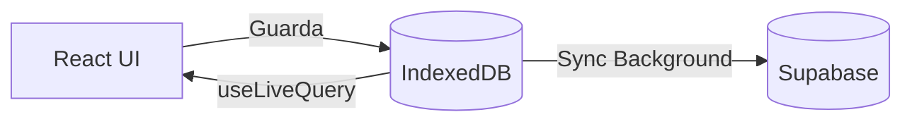
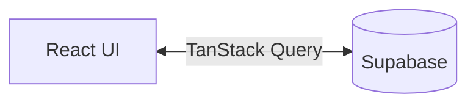

# Arquitectura del Sistema

LamkSew está construido utilizando una arquitectura híbrida que separa estrictamente la experiencia del operario (Offline-First) de la del administrador (Online/Realtime).

## Capas de la Aplicación

1. **UI Layer (React + Tailwind + Radix):** Componentes visuales puros y layouts protegidos por rol.
2. **State & Data Fetching:**
   - **Operario:** Usa `useLiveQuery` de Dexie para reaccionar a cambios en IndexedDB con latencia cero.
   - **Admin:** Usa TanStack Query para hacer fetch, cachear y dedulplicar peticiones directamente hacia Supabase.
3. **Persistencia Local (IndexedDB):** Gestionada mediante la clase `SewingDatabase` (Dexie) aislando lecturas y escrituras sin red.
4. **Persistencia Remota (Supabase):** PostgreSQL maneja la fuente de la verdad final, aplicando RLS para autorizar operaciones.

## Flujo de Datos

### Flujo del Trabajador (Desacoplado)
El trabajador nunca escribe directamente en la nube para evitar bloqueos de red.

### Flujo del Administrador (Directo)

El administrador requiere conexión permanente para ver datos en tiempo real.

## Dependencias Principales y su Rol

* **Vite + PWA Plugin:** Empaqueta la aplicación y registra el Service Worker para cachear HTML/CSS/JS y Google Fonts (permitiendo abrir la app sin internet).
* **Dexie.js:** Abstrae IndexedDB. Se usa porque soporta queries complejas (`.where`) y transacciones, algo imposible con `localStorage` o herramientas como Zustand persist.
* **TanStack Query:** Se usa exclusivamente en los reportes de administración para evitar recargar datos innecesariamente al cambiar de pestañas.
* **Supabase:** Actúa como BaaS (Backend as a Service) proveyendo Auth, Base de datos (Postgres) y capa de seguridad (RLS).