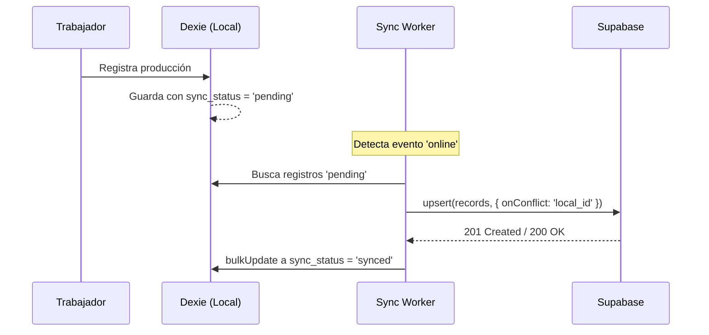

# Estrategia de Sincronización

Este documento explica cómo viajan los datos entre la base de datos local (IndexedDB) y la remota (Supabase).

## 1. Sync Down (De la Nube al Cliente)
Se utiliza para actualizar los catálogos base (Prendas, Operaciones, Colores).

* **Mecanismo:** Al detectar conexión, se obtienen los datos de Supabase.
* **Atomicidad:** Se utiliza una transacción `rw` (readwrite) en Dexie. Primero se limpia la tabla local (`clear()`) y luego se insertan los nuevos registros (`bulkAdd()`).
* **Fallo:** Si la red se corta a la mitad de la transacción, Dexie hace un *rollback* de la limpieza, garantizando que el operario nunca se quede con un catálogo vacío o corrupto.

## 2. Sync Up (Del Cliente a la Nube)
Se utiliza para enviar Turnos y Registros de Producción.

## 3. Idempotencia y Resolución de Conflictos

La aplicación confía en el campo `local_id` (UUIDv4 generado en el frontend al momento del registro) en lugar del `id` incremental de Postgres.

**¿Por qué?**
Si el dispositivo envía 10 registros a Supabase, el servidor los guarda, pero la conexión se corta antes de que el dispositivo reciba el `HTTP 200 OK`, los registros locales seguirán como `'pending'`.
En el siguiente intento, el dispositivo reenviará los mismos 10 registros. Gracias a `onConflict: 'local_id'`, Supabase simplemente actualizará las filas existentes en lugar de duplicarlas, evitando pagarle doble a un trabajador por error de red.

## 4. Escenarios de Fallo Reales

| Escenario | Comportamiento Actual | Estado Local |
| --- | --- | --- |
| Internet se pierde antes del envío | La petición nunca sale. El listener de red esperará. | `'pending'` |
| Internet se pierde durante la respuesta | El registro se guardó en BD remota, pero el cliente no se enteró. | `'pending'` |
| Reconexión tras el caso anterior | Se reenvía la data. Supabase ejecuta `upsert` sin duplicar. El cliente recibe el OK. | Cambia a `'synced'` |
| Supabase rechaza el registro (ej. RLS o validación SQL falla) | El catch del worker atrapa el error HTTP. | *Actual: Se mantiene `pending` para reintento. Mejora futura: Mover a `'error'` para revisión manual.* |